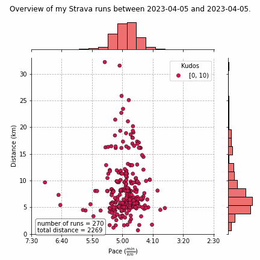

# Analysis 1 Overview and Script

This first analysis was found on a reddit post and helped curate a lot of the inspiration behind this little project. Inspiration and Credit: https://www.reddit.com/r/Strava/comments/zhpomr/comment/jfcamwd/?%252524deep_link=true&correlation_id=d483d718-645a-458d-9591-3e4fbd63c211&ref=email_comment_reply&ref_campaign=email_comment_reply&ref_source=email&%2525243p=e_as&_branch_match_id=1172948545114749768&utm_medium=Email%20Amazon%20SES&_branch_referrer=H4sIAAAAAAAAA31O7U7DMAx8mvKvLW3S0iJNCAnxAjyAFRJ3C%2BRLTrpqe3pcNv4i2dLpfOe7UykpP7ctoTG2NCqlxtnw3Yr0UvVSpAOCyg8MI9mjDcrBSu5w2l2VeK36d55t25q7X0fPBPF%2BFFJnxYApj6FkhtdTin4%2Fnm1elbNXVWwMEBfwF8i%2FBqA1ZMg2aIT%2BsZtZ%2FLVo5TezZwmOkwYxwV6yEm%2BFVqz6UUcidLdv1jBv5CTMUzfVoxxULYfJ1PMwd7VAuXyaUei%2B69hHuLAYvbIO7j2BMLnL7QYcnJQ9hn9FOa6k8U%2FyA%2B4AqAdRAQAA

# Results

  

